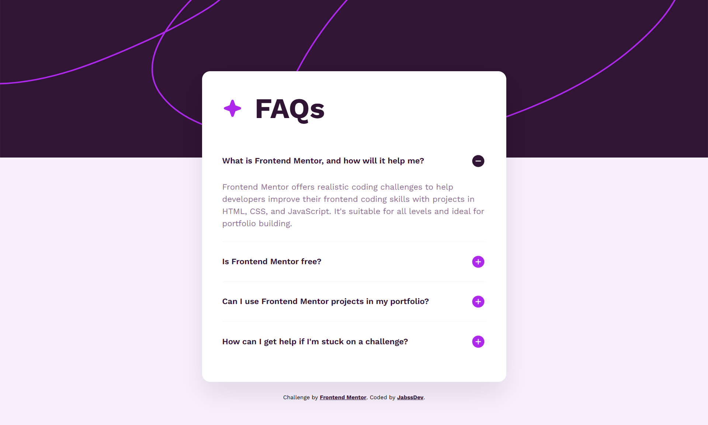

# Frontend Mentor - FAQ accordion solution

Esta es mi solución para el desafío [FAQ accordion challenge en Frontend Mentor](https://www.frontendmentor.io/challenges/faq-accordion-wyfFdeBwBz).

## Tabla de contenidos

- [Resumen](#resumen)
  - [El desafío](#el-desafío)
  - [Captura de pantalla](#captura-de-pantalla)
  - [Links](#links)
- [Mi proceso](#mi-proceso)
  - [Tecnologías utilizadas](#tecnologías-utilizadas)
  - [Lo que aprendí](#lo-que-aprendí)
  - [Desarrollo continuo](#desarrollo-continuo)
- [Autor](#autor)

## Resumen

### El desafío

Los usuarios deben ser capaces de:

- Ocultar/Mostrar la respuesta a una pregunta al hacer clic en ella.
- Navegar por las preguntas y mostrar respuestas utilizando únicamente el teclado.
- Visualizar un diseño óptimo para la interfaz independientemente del tamaño de pantalla de su dispositivo.
- Ver estados de hover y focus en todos los elementos interactivos.

### Captura de pantalla



### Links

- Solution URL: [GitHub Repository](https://github.com/jabssdev/faq-accordion-vanilla)
- Live Site URL: [GitHub Pages](https://jabssdev.github.io/faq-accordion-vanilla/)

## Mi proceso

### Tecnologías utilizadas

- Marcado semántico **HTML5**.
- Propiedades personalizadas de **CSS (Variables)**.
- **Flexbox** para alineación de componentes.
- **CSS Grid** para la lógica de animación de altura.
- Metodología **Mobile-first**.
- **JavaScript (ES6+)** para la lógica de interacción.

### Lo que aprendí

Este proyecto fue una excelente oportunidad para profundizar en la creación de componentes altamente accesibles y con animaciones fluidas sin sacrificar el rendimiento.

#### Accesibilidad avanzada (A11Y)

Implementé un sistema basado en atributos ARIA que permite a las tecnologías de asistencia entender el estado del acordeón en tiempo real:

```html
<button class="accordion-question" aria-expanded="false" aria-controls="answer-1">
	What is Frontend Mentor, and how will it help me?
	
</button>
<div class="accordion-answer" id="answer-1" role="region">
	<!-- Content -->
</div>
```

#### Animaciones "Zero-to-Hero" con CSS Grid

Uno de los mayores retos en CSS es animar un elemento de `height: 0` a `height: auto`. Utilicé la técnica moderna de `grid-template-rows` para lograr una transición fluida y performante:

```css
.accordion-answer {
	display: grid;
	grid-template-rows: 0fr;
	transition: grid-template-rows 0.3s ease-out;
}

.accordion-question[aria-expanded="true"] + .accordion-answer {
	grid-template-rows: 1fr;
}
```

#### Lógica de JavaScript Eficiente

Utilicé **Delegación de Eventos** para manejar todos los ítems del acordeón desde un único "listener" en el contenedor padre, optimizando el uso de memoria:

```javascript
accordion.addEventListener("click", (event) => {
	const button = event.target.closest(".accordion-question");
	if (button) toggleItem(button);
});
```

### Desarrollo continuo

En proyectos futuros, planeo seguir explorando:

- El uso de la API de animaciones nativa (Web Animations API) para micro-interacciones más complejas.
- Implementación de pruebas automatizadas de accesibilidad (Axe-core).

## Autor

- Frontend Mentor - [@jabssdev](https://www.frontendmentor.io/profile/jabssdev)
- GitHub - [jabssdev](https://github.com/jabssdev)
